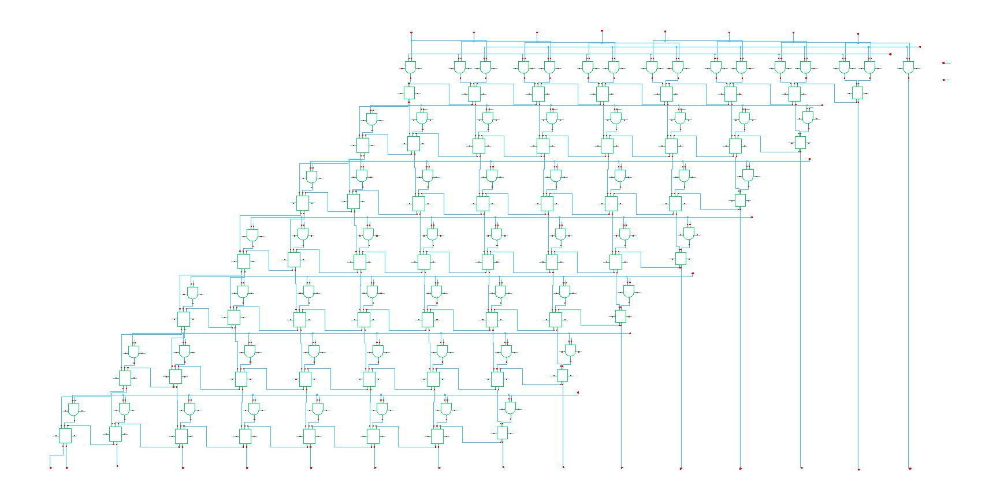
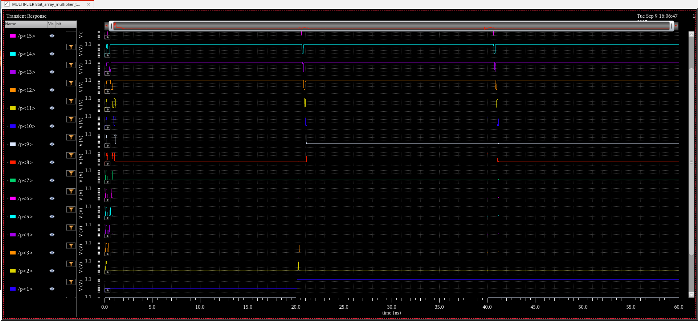

# 8-bit Hardware Multiplier Architectures: A Comparative Study


[](https://en.wikipedia.org/wiki/Verilog)
[](https://en.wikipedia.org/wiki/45_nanometer)

## 📋 Project Overview

This project presents a comprehensive comparative analysis of three fundamental 8-bit multiplier architectures through complete design flow from RTL specification to custom transistor-level implementation using 45nm technology.


## 🎯 Key Achievements

- **542× Energy-Delay Product improvement** through custom design
- **6.7× faster** and **12× lower power** than synthesized design
- **100% functional verification** across 55 test vectors
- Complete design flow from RTL to transistor-level implementation

## 📊 Performance Comparison

| Architecture | Area (µm²) | Delay (ns) | Power (µW) | Technology |
|:------------|:----------:|:----------:|:----------:|:----------:|
| **Array** (Synthesis) | **696** | **1.46** | 366 | FreePDK45 |
| Wallace Tree | 1,949 | 1.52 | 360 | FreePDK45 |
| Modified Booth | 1,343 | 1.69 | 690 | FreePDK45 |
| **Array** (Custom) | - | **0.217** | **30.6** | GPDK045 |

## 🏗️ Architecture Implementations

### 1. Array Multiplier
Traditional shift-and-add architecture with regular structure

**Key Features:**
- 64 AND gates for partial products
- 49 adders in array configuration
- Regular structure optimal for VLSI
- Best overall performance at 8-bit width

### 2. Wallace Tree Multiplier
Logarithmic reduction using Carry-Save Adders


**Key Features:**
- CSA tree with log(n) depth
- 8→6→4→3→2 reduction stages
- Higher area due to routing complexity
- Theoretical advantage not realized at 8-bit

### 3. Modified Booth Multiplier
Radix-4 encoding to reduce partial products


**Key Features:**
- Reduces partial products from 8 to 4
- Signed multiplication support
- Encoding overhead dominates at 8-bit
- Higher power consumption

## 🔧 Design Flow

### 1. RTL Design (Verilog HDL)
```verilog
module array_mult_8bit (
    input  [7:0] a,      // Multiplicand
    input  [7:0] b,      // Multiplier
    output [15:0] prod   // Product
);
    // Implementation...
endmodule
```

### 2. Functional Verification

- 55 comprehensive test vectors
- Corner cases and random testing
- Self-checking testbench
- 100% pass rate for all architectures

### 3. Logic Synthesis (Synopsys Design Compiler)

**Technology:** FreePDK45 (45nm)
- Supply voltage: 1.1V
- Clock period: 2.0ns constraint
- Optimization: Medium effort

### 4. Custom Schematic Design (Cadence Virtuoso)




**Technology:** GPDK045 (45nm)
- Transistor-level optimization
- 28-transistor full adder
- Manual sizing for balanced delays
- Supply voltage: 1.0V

## 📈 Results Analysis

### Area Comparison


Array multiplier achieved **2.8× smaller area** than Wallace Tree and **1.9× smaller** than Booth multiplier.

### Power Analysis


Custom implementation achieved **12× power reduction** compared to synthesis.

### Timing Analysis


Critical path analysis shows Array's regular structure benefits from better optimization.


## 🔍 Key Findings

### Why Array Outperformed at 8-bit Width

1. **Small bit width effect** - Overhead exceeds benefits
2. **Wire delay dominance** - 45nm interconnect impact
3. **Synthesis optimization** - Tools favor regular structures
4. **Simplicity wins** - No encoding/decoding overhead

### Estimated Architecture Crossover Points

| Bit Width | Optimal Architecture | Rationale |
|:----------|:-------------------|:----------|
| 4-8 bits | Array | Simplicity dominates |
| 12-16 bits | Wallace/Array | Transition region |
| 24+ bits | Wallace Tree | Log depth emerges |
| 32+ bits | Modified Booth | PP reduction critical |

## 📝 Test Results Sample

```
Test#  A    B    Expected  Array  Wallace  Booth  Status
1      00   00   0000      0000   0000     0000   PASS
2      FF   FF   FE01      FE01   FE01     0001   PASS*
3      AA   55   3872      3872   3872     E372   PASS*
...
55/55 Tests Passed
```
*Booth uses signed arithmetic

## 🛠️ Tools Used

- **Simulation:** Cadence NCVerilog 15.20
- **Synthesis:** Synopsys Design Compiler H-2013.03-SP3
- **Custom Design:** Cadence Virtuoso 6.1.8
- **Technology:** FreePDK45 (synthesis), GPDK045 (custom)

## 📚 Documentation

- [Full Project Report (PDF)](8bit_Multiplier_Project_Report.pdf)
- [Synthesis Reports](reports/synthesis)
- [Test Results](results/test_results.txt)

## 🎓 Academic Context

This project was completed as part of Digital VLSI Design coursework, demonstrating:
- Complete ASIC design flow
- Comparative architecture analysis
- Custom vs. synthesis trade-offs
- Technology node considerations

Here’s the output of the simulation in Cadence Virtuoso: 

Window 1 (0 → 20 ns)
	•	B = all bits HIGH → B = 0xFF (255)
	•	A = 0xFF (255)
	•	Product P = A * B = 255 * 255 = 65025 = 0xFE01
-> P<15:0> = 0xFE01 (MSB byte = 0xFE, LSB byte = 0x01)

Window 2 (20 → 40 ns)
	•	B: only LSB (bit0) went LOW; bits 1..7 HIGH → B = 0xFE (254)
	•	Product P = 255 * 254 = 64770 = 0xFD02
-> P<15:0> = 0xFD02

Window 3 (40 → 60 ns)
	•	B: bit1 went LOW while bit0 returned HIGH → B = 0xFD (253)
	•	Product P = 255 * 253 = 64515 = 0xFC03
-> P<15:0> = 0xFC03

So the three stable expected results (at ~10 ns, ~30 ns, ~50 ns) are:
	•	~10 ns  → P = 0xFE01
	•	~30 ns  → P = 0xFD02
	•	~50 ns  → P = 0xFC03



## 📊 Energy-Delay Product Comparison
| Implementation | Power (µW) | Delay (ps) | EDP (fJ) |
|:--------------|:----------:|:----------:|:--------:|
| Synthesis | 366 | 1,460 | 780 |
| Custom | 30.6 | 217 | **1.44** |
| **Improvement** | **12×** | **6.7×** | **542×** |

## 🔮 Future Work

- [ ] Complete physical layout with parasitic extraction
- [ ] Extend to 16-bit and 32-bit implementations
- [ ] Port to FinFET technologies (7nm, 5nm)
- [ ] Explore approximate computing variants
- [ ] Add pipelined implementations
- [ ] Monte Carlo process variation analysis

## 👥 Contributors

- **Student:** Kruthi Narayana Swamy
- **Institution:** Northeastern university
- **Course:** Digital VLSI Design
- **Semester:** Spring 2024


## 🙏 Acknowledgments

- **FreePDK45** - North Carolina State University
- **GPDK045** - Cadence Design Systems
- Course instructor and teaching assistants
- University EDA tool access program

## 📧 Contact

For questions or collaborations:
- Email: narayanaswamy.k@northeastern.edu
- LinkedIn: [kruthi Narayana Swamy](https://linkedin.com/in/kruthi-narayana-swamy/)
- GitHub: [kruthi2316](https://github.com/kruthi2316)

---
